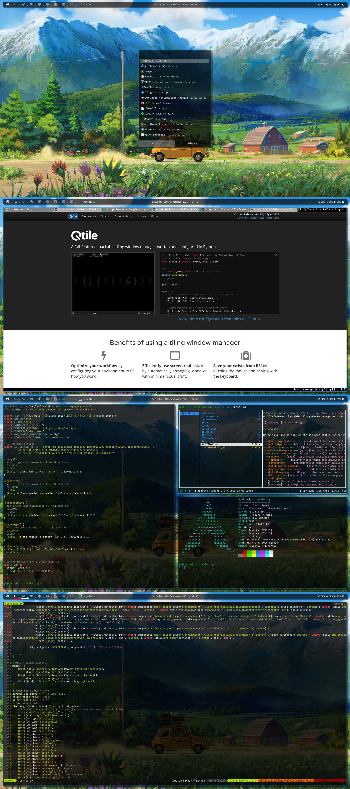

# Various dotfiles for my [i3-gaps](https://i3wm.org/) setup.
i3 is a tiling window manager, completely written from scratch. The target platforms are GNU/Linux and BSD operating systems, our code is Free and Open Source Software (FOSS) under the BSD license. i3 is primarily targeted at advanced users and developers.

## Details

Below is a list of some of the packages that I use for my current setup.

- **Operating System** --- [Archlinux](https://www.archlinux.org/)
- **AUR Helper** --- [Paru](https://aur.archlinux.org/packages/paru-git/)
- **Boot Loader** --- [Grub](https://wiki.archlinux.org/index.php/GRUB)
- **Window Manager** --- [i3-gaps-next-git](https://aur.archlinux.org/packages/i3-gaps-next-git)
- **Screen Locker** --- [Betterlockscreen](https://aur.archlinux.org/packages/betterlockscreen)
- **Shell** --- [Bash](https://wiki.archlinux.org/index.php/Bash) using [Starship](https://aur.archlinux.org/packages/starship-git/) 
- **Terminal** --- [Kitty](https://wiki.archlinux.org/index.php/Kitty)
- **Compositor** --- [Picom](https://wiki.archlinux.org/index.php/Picom)
- **Notification Daemon** --- [Dunst](https://wiki.archlinux.org/index.php/Dunst)
- **Application Launcher** --- [Rofi](https://wiki.archlinux.org/index.php/Rofi)
- **File Manager** --- [Ranger](https://aur.archlinux.org/packages/ranger-git)
- **Editor** --- [Neovim](https://aur.archlinux.org/packages/neovim-git)
  - **Plugins**
	- [gruvbox](https://github.com/morhetz/gruvbox)
	- [coc.nvim](https://github.com/neoclide/coc.nvim)
	- [vim-polyglot](https://github.com/sheerun/vim-polyglot)
	- [vim-startify](https://github.com/mhinz/vim-startify)
	- [tagbar](https://github.com/preservim/tagbar)
	- [nerdtree](https://github.com/preservim/nerdtree)
	- [vim-devicons](https://github.com/ryanoasis/vim-devicons)
	- [vim-airline](https://github.com/vim-airline/vim-airline)
	- [vim-airline-themes](https://github.com/vim-airline/vim-airline-themes)
	- [indentLine](https://github.com/Yggdroot/indentLine)
	- [vim-hexokinase](https://github.com/rrethy/vim-hexokinase)
- **Web Browser** --- [Qutebrowser](https://www.qutebrowser.org)
- **PDF Viewer** --- [Zathura](https://wiki.archlinux.org/index.php/Zathura)
- **IRC** --- [Weechat](https://weechat.org/)
- **RSS Feed Reader** --- [Newsboat](https://aur.archlinux.org/packages/newsboat-git)
- **Youtube search** --- [Ytfzf](https://aur.archlinux.org/packages/ytfzf/)
- **Video player** --- [Mpv](https://aur.archlinux.org/packages/mpv-git)

## Keybindings
### Window manager controls
| Keys                                 | Action                    |
| ------------------------------------ | ------------------------- |
| <kbd>SHIFT + MOD + r</kbd>           | restart i3wm              |
| <kbd>SHIFT + MOD + e</kbd>           | shutdown i3wm             |
| <kbd>SHIFT + MOD + q</kbd>           | kill window               |
| <kbd>MOD + RETURN</kbd>              | spawn terminal            |
| <kbd>MOD + D</kbd>                   | Rofi menu                 |
| <kbd>CTRL + MOD + p</kbd>            | Rofi power menu           |
